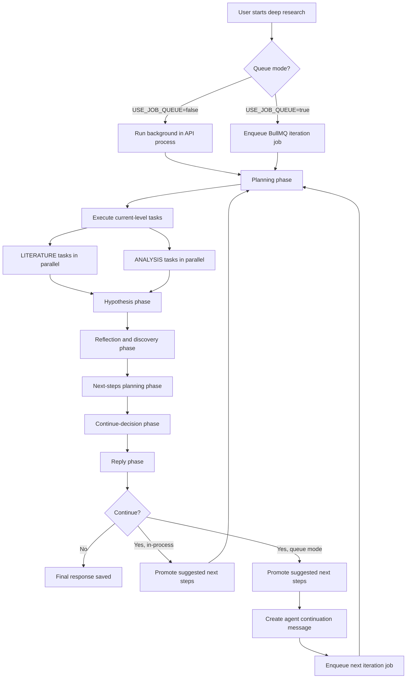
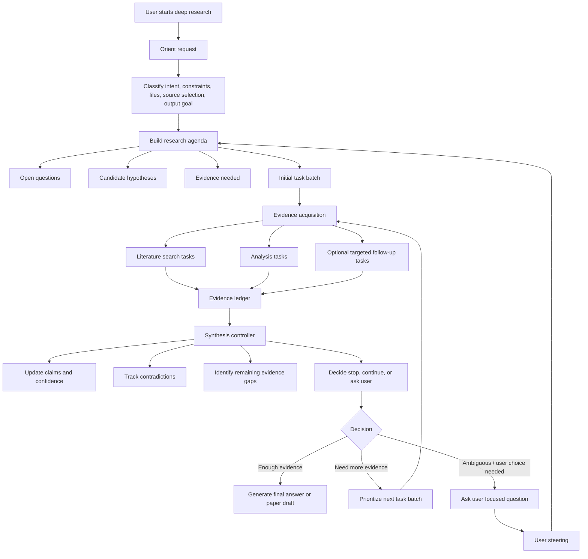
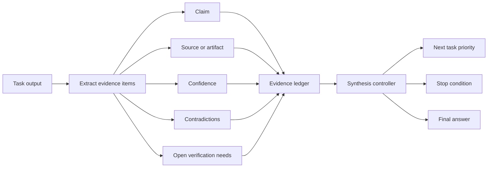
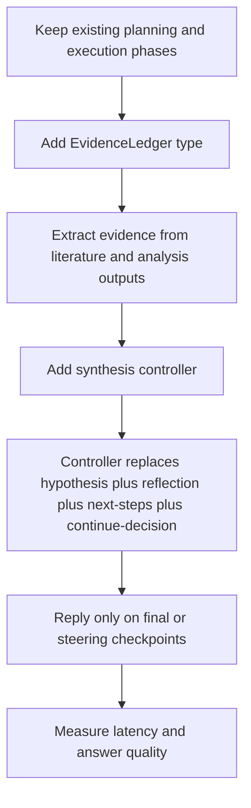

# Adaptive Deep Research Flow

This is a brainstorming artifact for improving Deep Research beyond the current
fixed phase pipeline. It is not an implementation plan yet.

## Current Flow

The current implementation runs a fixed sequence on every iteration. The tasks
inside execution are dynamic, but the orchestration shape is static.



## Proposed Flow

The proposed architecture keeps the useful primitives, but changes the loop from
a fixed assembly line into an adaptive evidence loop.



## Evidence Ledger

The core state should move from mostly free-text task outputs to a structured
ledger that every loop reads and updates.



Suggested shape:

```ts
type EvidenceLedger = {
  claims: Array<{
    claim: string;
    evidence: Array<{
      taskId: string;
      sourceUrl?: string;
      doi?: string;
      artifactId?: string;
      finding: string;
    }>;
    confidence: "low" | "medium" | "high";
    contradictions: string[];
    needsVerification: string[];
  }>;
  openQuestions: string[];
  nextTasks: PlanTask[];
};
```

## Why This Is Better

### Fewer sequential LLM calls

The current loop splits hypothesis, reflection, next-step planning, continue
decision, and reply into separate phases. Those phases all inspect the same
task outputs and world state. Combining most of that into a single synthesis
controller removes repeated context loading and reduces latency.

### Less unnecessary user-facing writing

The current loop generates a reply every iteration, even when it will continue
automatically. A better loop emits progress and updates structured state during
intermediate iterations, then writes a user-facing response only when stopping,
asking for steering, or explicitly producing a checkpoint.

### Better research quality

The current system can accumulate useful text, but it does not make evidence the
main control surface. An evidence ledger lets the controller decide based on
claim support, contradictions, missing citations, and confidence rather than
only whether `suggestedNextSteps` exists.

### More adaptive task selection

The current phase order is static. It always does planning, execution,
hypothesis, reflection, next-step planning, continue decision, and reply. The
adaptive loop still has stable invariants, but can skip work that is not useful:

- no analysis task if there is no usable dataset or artifact;
- no new literature search if the evidence gap is analytical;
- no final prose generation until the loop stops;
- no continuation when new tasks have low marginal value.

### Cleaner stopping criteria

The current loop stops mostly through empty next-step plans, mode rules, or
iteration caps. The proposed loop can stop because specific evidence conditions
are met:

- enough high-confidence claims answer the question;
- remaining gaps are low value;
- sources contradict each other and user steering is needed;
- external task failures prevent useful progress;
- budget or time limits are reached.

## Migration Path

This can be introduced incrementally without deleting the current phase modules.



Recommended first implementation step:

1. Keep `runPlanningPhase` and `runExecutionPhase`.
2. Add a `runSynthesisDecisionPhase` that returns:
   - updated hypothesis;
   - key insights;
   - discoveries;
   - evidence ledger updates;
   - next tasks;
   - stop / continue / ask-user decision.
3. Keep the existing reply phase, but call it only when the controller says the
   iteration should produce a user-facing checkpoint.

