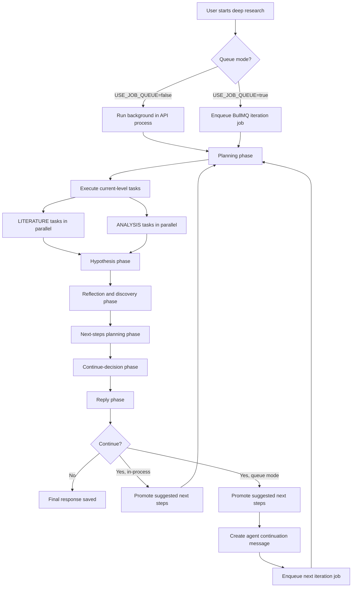
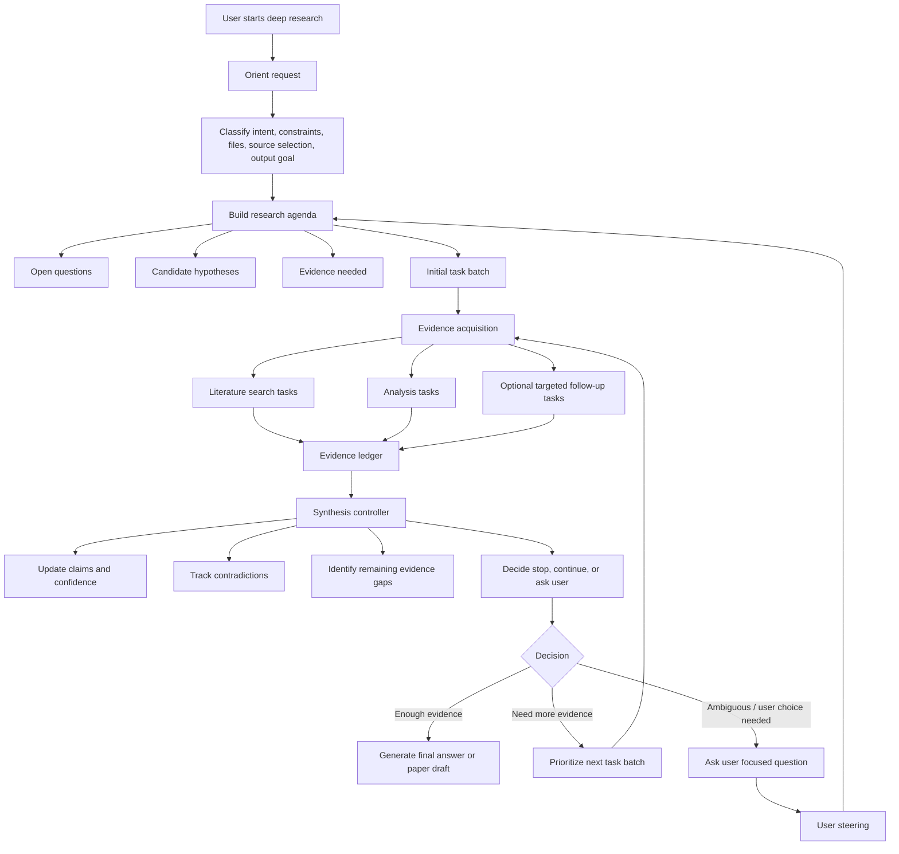
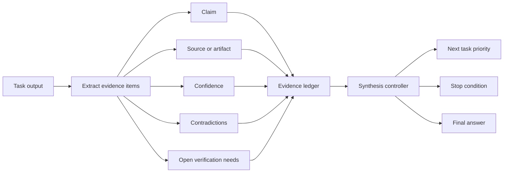
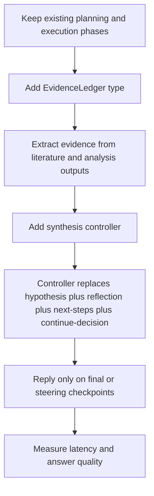

# Adaptive Deep Research Flow

This is a brainstorming artifact for improving Deep Research beyond the current
fixed phase pipeline. It is not an implementation plan yet.

## Current Flow

The current implementation runs a fixed sequence on every iteration. The tasks
inside execution are dynamic, but the orchestration shape is static.



## Proposed Flow

The proposed architecture keeps the useful primitives, but changes the loop from
a fixed assembly line into an adaptive evidence loop.



## Evidence Ledger

The core state should move from mostly free-text task outputs to a structured
ledger that every loop reads and updates.



Suggested shape:

```ts
type EvidenceLedger = {
  claims: Array<{
    claim: string;
    evidence: Array<{
      taskId: string;
      sourceUrl?: string;
      doi?: string;
      artifactId?: string;
      finding: string;
    }>;
    confidence: "low" | "medium" | "high";
    contradictions: string[];
    needsVerification: string[];
  }>;
  openQuestions: string[];
  nextTasks: PlanTask[];
};
```

## Why This Is Better

### Estimated LLM Call Reduction

These are planning estimates based on the current phase sequence, not measured
latency benchmarks. Tool calls inside literature or analysis tasks may add their
own model calls depending on the downstream service.

| Step | Current loop per iteration | Proposed loop per iteration | Reduction |
| --- | ---: | ---: | ---: |
| Orient request | 0-1 | 1 only at session start | Same or +1 upfront |
| Initial planning / agenda | 1 | 1 | Same |
| Hypothesis update | 1 | Included in synthesis controller | -1 |
| Reflection / world-state update | 1 | Included in synthesis controller | -1 |
| Discovery extraction | 0-1 conditional | Included in synthesis controller or evidence extraction | 0 to -1 |
| Next-step planning | 1 | Included in synthesis controller | -1 |
| Continue decision | 0-1 conditional | Included in synthesis controller | 0 to -1 |
| Reply generation | 1 every iteration | 1 only on final / checkpoint / steering | Usually -1 on intermediate iterations |
| **Typical intermediate iteration total** | **5-7 LLM calls** | **1-2 LLM calls** | **about 60-80% fewer orchestration calls** |
| **Typical final iteration total** | **5-7 LLM calls** | **2-3 LLM calls** | **about 50-65% fewer orchestration calls** |

Example for a 3-iteration semi-autonomous run:

| Model | Iteration 1 | Iteration 2 | Final iteration | Approx total |
| --- | ---: | ---: | ---: | ---: |
| Current fixed pipeline | 6 | 6 | 6 | 18 LLM calls |
| Proposed adaptive loop | 2 | 1-2 | 2-3 | 5-7 LLM calls |
| Approx savings | 4 | 4-5 | 3-4 | 11-13 fewer calls |

### Improvement Summary

| Improvement | Current approach | Proposed approach | Why it helps |
| --- | --- | --- | --- |
| Fewer sequential LLM calls | Hypothesis, reflection, next-step planning, continue decision, and reply are separate phases that reread similar context. | A synthesis controller updates hypothesis, insights, discoveries, evidence gaps, next tasks, and stop/continue decision in one pass. | Less repeated context loading, lower latency, fewer chances for phase-to-phase drift. |
| Less unnecessary user-facing writing | A reply is generated every iteration, even when the system will continue automatically. | Intermediate iterations update structured state and progress; user-facing prose is generated only for final answers, checkpoints, or steering. | Saves one expensive writing call per auto-continued iteration and avoids noisy partial answers. |
| Better research quality | Useful text accumulates, but evidence is not the central control surface. | The evidence ledger tracks claims, support, contradictions, citations/artifacts, confidence, and verification needs. | The loop decides from evidence quality, not just whether `suggestedNextSteps` exists. |
| More adaptive task selection | The phase order is static and runs the same synthesis-like stages every iteration. | The controller chooses the next task batch from evidence gaps and can skip irrelevant work. | Avoids unnecessary analysis without data, unnecessary literature search when the gap is analytical, and low-value continuation. |
| Cleaner stopping criteria | Stopping is mostly empty next-step plans, mode rules, or iteration caps. | Stopping is based on evidence conditions: enough supported claims, low-value remaining gaps, contradictions needing user steering, failures, budget, or time. | Produces clearer finality and better user trust. |

## Migration Path

This can be introduced incrementally without deleting the current phase modules.



Recommended first implementation step:

1. Keep `runPlanningPhase` and `runExecutionPhase`.
2. Add a `runSynthesisDecisionPhase` that returns:
   - updated hypothesis;
   - key insights;
   - discoveries;
   - evidence ledger updates;
   - next tasks;
   - stop / continue / ask-user decision.
3. Keep the existing reply phase, but call it only when the controller says the
   iteration should produce a user-facing checkpoint.
